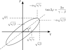

.. _theory:

Introduction
============

Concepts
--------

Reference Trajectory
""""""""""""""""""""

ImpactX is an *s*-based beam dynamics code with space charge.
Particles are tracked using the longitudinal accelerator lattice position :math:`s` as the independent dynamical variable.
Particle phase space coordinates are specified relative to a nominal reference trajectory.

The reference trajectory plays an important role in ImpactX.
In addition to specifying the nominal machine orbit, it specifies the relationship between the local beam coordinate system and the global lab coordinate system.
A reference trajectory is favorable instead of, e.g., differences to the beam centroid, because:

#. the reference trajectory is the ideal single-particle orbit used as part of the optics design, so it is better that it can be computed independently of the beam distribution,
#. differences between the beam centroid and the reference particle are important when investigating the effects of misalignments and errors for beamline designs,
#. the fields are usually specified relative to the reference trajectory, and the dynamics becomes more nonlinear as one moves away from the reference trajectory, so knowing how far the beam particles are form the reference trajectory is important for accuracy,
#. we want to keep track of the reference trajectory in global coordinates, and that global information is not available in the particle data alone, so it would need to be specified in some other way.

The reference values of :math:`z=ct` and :math:`s` should be identical until reaching a bending element.
(If the lattice contains no bending elements, then they should coincide.)
Also, the reference value of :math:`ct` coincides with the value of :math:`s` in the ultrarelativistic limit.
More generally, the derivative :math:`ds/d(ct) = \beta`, where the relativistic :math:`\beta = \sqrt{1-\frac{1}{p_t^2}}`.

Collective Effects
""""""""""""""""""

Collective effects from space charge of the particle beam are solved between steps in :math:`s`.
One can set the number of slice steps through each lattice element for the application of the space charge push.

.. note::

   Currently, space charge kicks are calculated in 3D.
   A 2D space-charge solver for purely transversal effects will be added in the future.

Coordinates and Units
---------------------

Each particle in the beam is described at fixed :math:`s` by a set of 6 canonical phase space variables (x [m], px, y [m], py, t [m], pt).  Coordinates x and y denote the horizontal and
vertical displacement from the reference particle, respectively, and describe motion in the plane transverse to the velocity of the reference particle.  The longitudinal coordinate t
denotes the difference between the arrival time of the particle and the arrival time of the reference particle, multiplied by the speed of light :math:`c`.

The momenta conjugate to x, y, and t are denoted px, py, and pt, respectively.  These variables are normalized by the magnitude of the momentum of the reference particle, and are therefore dimensionless.
In a region of zero vector potential, for example, :math:`p_x = \Delta(\beta_x\gamma)/(\beta_0\gamma_0)`, where :math:`\beta_0` and :math:`\gamma_0` denote the relativistic
factors associated with the reference velocity.  In a region of zero scalar potential, pt denotes the deviation from the reference energy normalized by the design momentum
times the speed of light, so that :math:`p_t = \Delta(\gamma)/(\beta_0\gamma_0)`.

Unlike particles within the beam, the reference particle is described by a set of 8 phase space variables (x [m], px, y [m], py, z [m], pz, t [m], pt) that are specified
in a global laboratory coordinate system (x,y,z).  The momenta of the reference particle are normalized by :math:`mc`, so that :math:`p_x=\beta_x\gamma`, etc.  A parameteric plot of
the reference trajectory variables (x,z) allows the user to view the global geometry of the accelerator structure (footprint).

.. _theory-collective-beam-distribution-input:

Beam Distribution Input
-----------------------

   Phase space ellipse in the coordinate plane of position :math:`q` (realized as :math:`x`, :math:`y`, and :math:`t`) and associated conjugate momentum :math:`q` (realized as :math:`p_x`, :math:`p_y` and :math:`p_t`).

Particle beam user input in ImpactX can be done in two ways.

The first option is to characterize the distribution via the intersections of the phase space ellipse with the coordinate axes and the correlation terms of the canonical coordinate pairs.

.. math::

   \begin{align}
        \lambda_q &= \sqrt{\frac{\epsilon}{\gamma}} \\
        \lambda_p &= \sqrt{\frac{\epsilon}{\beta}} \\
        \mu_{qp} &= \frac{\alpha}{\sqrt{\beta \gamma}}
   \end{align}

The units are :math:`[\lambda_q] = \mathrm{m}`, :math:`[\lambda_p] = \mathrm{rad}`, and :math:`[\mu_{qp}] = 1`.
To convert between normalized and unnormalized emittance, use the relation :math:`\epsilon_\mathrm{n} = (\beta\gamma)_\mathrm{ref} \cdot \epsilon` which uses the momentum of the reference particle.
**Attention**: Here, :math:`(\beta\gamma)_\mathrm{ref}` are the Lorentz variables for the reference particle momentum and not the Courant-Snyder parameters.

The second option is to specify the distribution via the Courant-Snyder / Twiss parameters :math:`\alpha` and :math:`\beta` along with the unnormalized (geometric, 1-RMS) emittance :math:`\epsilon` for all the spatial coordinates.
Recall the Courant-Snyder relation :math:`\gamma\beta - \alpha^2 = 1` for conversion from :math:`\gamma` values to our input conventions.

Distribution Sampling and the Covariance Matrix
-----------------------------------------------

In Impact-X, beam sampling is performed under the assumption that the initial beam distribution has a centroid (mean phase space vector) that coincides with the phase space origin.  The covariance matrix :math:`\Sigma` is defined by :math:`\Sigma_{ij}=\langle{\zeta_i\zeta_j\rangle}`, where :math:`\zeta` denotes the vector of phase space coordinates.

Let :math:`P` denote a phase space probability density with unit covariance matrix (i.e., equal to the identity matrix).  To produce a phase space density with a target covariance matrix :math:`\Sigma`, we write :math:`\Sigma` in terms of its (lower) Cholesky decomposition as:

.. math::

   \begin{equation}
        \Sigma = LL^T,
   \end{equation}

where :math:`L` is a lower triangular matrix.

Define a beam distribution function :math:`f` by:

.. math::

   \begin{equation}
       f(\zeta)=\kappa P(L^{-1}\zeta),\quad\text{ where }\quad \kappa=|\det L|^{-1}.
   \end{equation}

Then :math:`f` has the desired covariance matrix :math:`\Sigma`.  Samples from :math:`f` are obtained by sampling from :math:`P` and performing the linear transformation :math:`\zeta\mapsto L\zeta`.

Let :math:`P` above denote a 2D probability distribution that is radially symmetric, in the sense that:

.. math::

   \begin{equation}
        P(\zeta)=G(||\zeta||^2)=G(q^2+p^2),\quad\quad \zeta=(q,p)
   \end{equation}

Here :math:`q` denotes a position coordinate (e.g., :math:`x`, :math:`y`, or :math:`t`) and :math:`p` denotes the corresponding conjugate momentum.

Then the resulting distribution :math:`f` has 2D elliptical symmetry, in the sense that:

.. math::

   \begin{equation}
        f(\zeta)\propto P(L^{-1}\zeta)=G(||L^{-1}\zeta||^2)=G(\zeta^TS\zeta),\quad\quad S=\Sigma^{-1}.
   \end{equation}

The argument of :math:`G` is a quadratic form in :math:`(q,p)`, and it is convenient to express this quadratic form as:

.. math::

   \begin{equation}
        \zeta^TS\zeta = \frac{q^2}{\lambda_q^2} + 2\mu_{qp}\frac{qp}{\lambda_q\lambda_p}+\frac{p^2}{\lambda_p^2}=\frac{1}{\epsilon}\left(\gamma q^2+2\alpha qp + \beta p^2\right).
   \end{equation}

Here :math:`\alpha`, :math:`\beta`, and :math:`\gamma` denote the Courant-Snyder Twiss functions, and :math:`\epsilon` denotes the rms (unnormalized) emittance.

The associated covariance matrix may be written explicitly in terms of the above parameters as:

.. math::

   \begin{equation}
        \begin{pmatrix}
            \lambda_q & 0 \\
            0 & \lambda_p
        \end{pmatrix}
        \begin{pmatrix}
            1 & \mu_{qp} \\
            \mu_{qp} & 1
        \end{pmatrix}^{-1}
        \begin{pmatrix}
            \lambda_q & 0 \\
            0 & \lambda_p
        \end{pmatrix} = \epsilon
        \begin{pmatrix}
            \beta & -\alpha \\
           -\alpha & \gamma
        \end{pmatrix}.
   \end{equation}

Note:  In the special case that :math:`\mu_{qp}=0`, we have :math:`\lambda_q=\sigma_q` and :math:`\lambda_p=\sigma_p`, where :math:`\sigma_q=\langle{q^2\rangle}^{1/2}` and :math:`\sigma_p=\langle{p^2\rangle}^{1/2}`.

Assumptions
-----------

This is an overview of physical assumptions implemented in the numerics of ImpactX.

Tracking and Lattice Optics
"""""""""""""""""""""""""""

Tracking through lattice optics in ImpactX is performed by updating the canonical phase space variables (x,px,y,py,t,pt) using symplectic transport.
The elements supported currently fall into one of the following categories:

* **zero-length (thin) elements**, such as multipole kicks and coordinate transformations
* **ideal (thick) elements** using a hard-edge fringe field approximation, such as drifts, quadrupoles, and dipoles
* **soft-edge elements** described by :math:`s`-dependent, user-provided field data, such as RF cavities
* **ML surrogate models** using a trained neural network (not necessarily symplectic)

Transport may be performed using one of three possible levels of approximation to the underlying Hamiltonian:

* **linear transfer map (default):** obtained by expanding the Hamiltonian through terms of degree 2 in the deviation of phase space variables from those of the reference particle
* **chromatic or paraxial approximation:** obtained by expanding the Hamiltonian through terms of degree 2 in the transverse phase space variables, while retaining the nonlinear dependence on the energy variable pt
* **exact Hamiltonian:** obtained using the exact nonlinear Hamiltonian

Space Charge (Poisson Solver)
"""""""""""""""""""""""""""""

  * **velocity spread:** when solving for space-charge effects, we assume that the relative spread of velocities of particles in the beam is negligible compared to the velocity of the reference particle, so that in the bunch frame (rest frame of the reference particle) particle velocities are nonrelativistic

* **electrostatic in the bunch frame:** we assume there are no retardation effects and we solve the Poisson equation in the bunch frame
