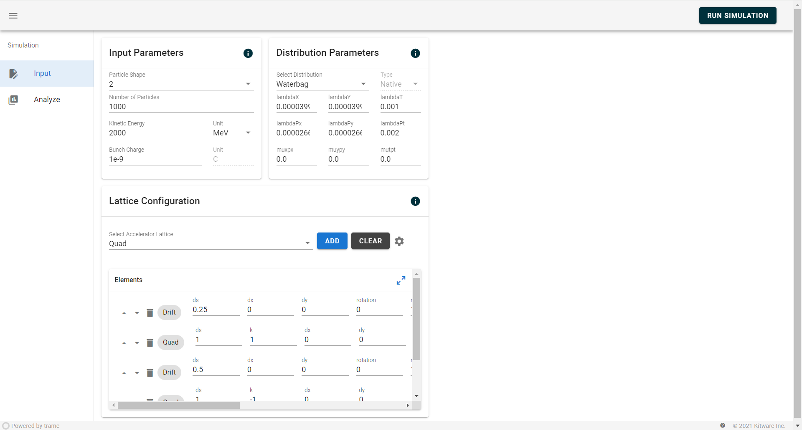

.. _usage-python:

Dashboard
==================

This document provides instructions on how to launch the ``impactx-dashboard``.

Installing Dependencies
-----------------------
To install the necessary dependencies, navigate to the ``impactx/src/python/impactx/dashboard`` directory and execute the following command:

.. code-block:: bash

   pip install -r requirements.txt

Launching the Dashboard
-----------------------

1. **CLI Command (Recommended for Most Users):**
   Navigate to the ``impactx`` directory and execute:

   .. code-block:: bash

      impactx-dashboard

2. **Python Module (Flexible for Developers):**
   Navigate to the ``impactx/src/python/impactx/dashboard`` directory and run the module using:

   .. code-block:: bash

      python -m dashboard

3. **JupyterLab:**
   Navigate to the ``impactx/src/python/impactx/dashboard`` directory and start JupyterLab using:

   .. code-block:: bash

      jupyter-lab

   After opening JupyterLab, run the following Python code in a notebook to initialize and display the dashboard:

   .. code-block:: python

      from dashboard.jupyterApplication import JupyterMainApplication

      # Create new application instance
      app = JupyterMainApplication()

      # Start the server and wait for the UI to be ready
      await app.ui.ready

      # Display the UI in the JupyterLab notebook
      app.ui

Navigating the GUI
------------------

The GUI is designed with a user-friendly interface that includes multiple tabs and menu options:

- **Input Tab**: Allows users to adjust simulation parameters.
- **Run Tab**: Enables users to initiate simulations and monitor ongoing processes.
- **Analyze Tab**: Provides tools for users to visualize and analyze their simulation outputs.

   Input section in the dashboard.
