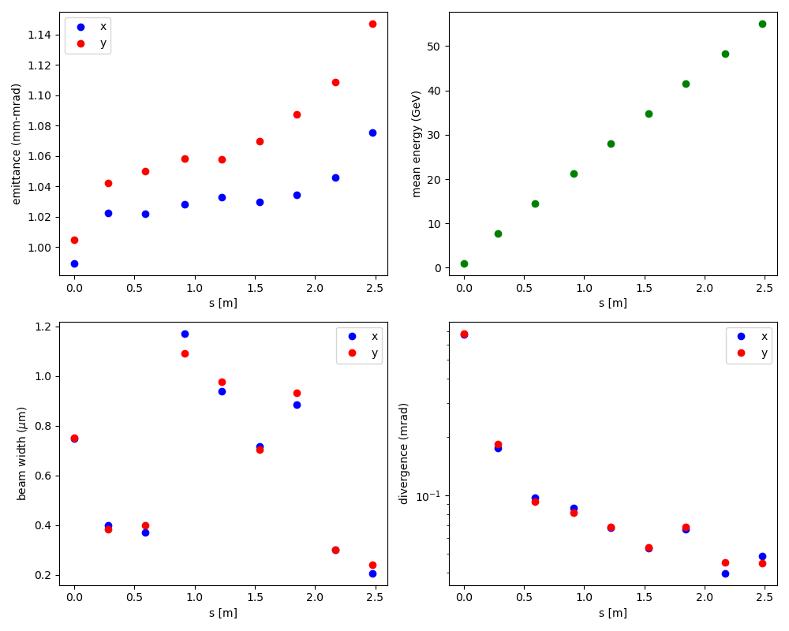
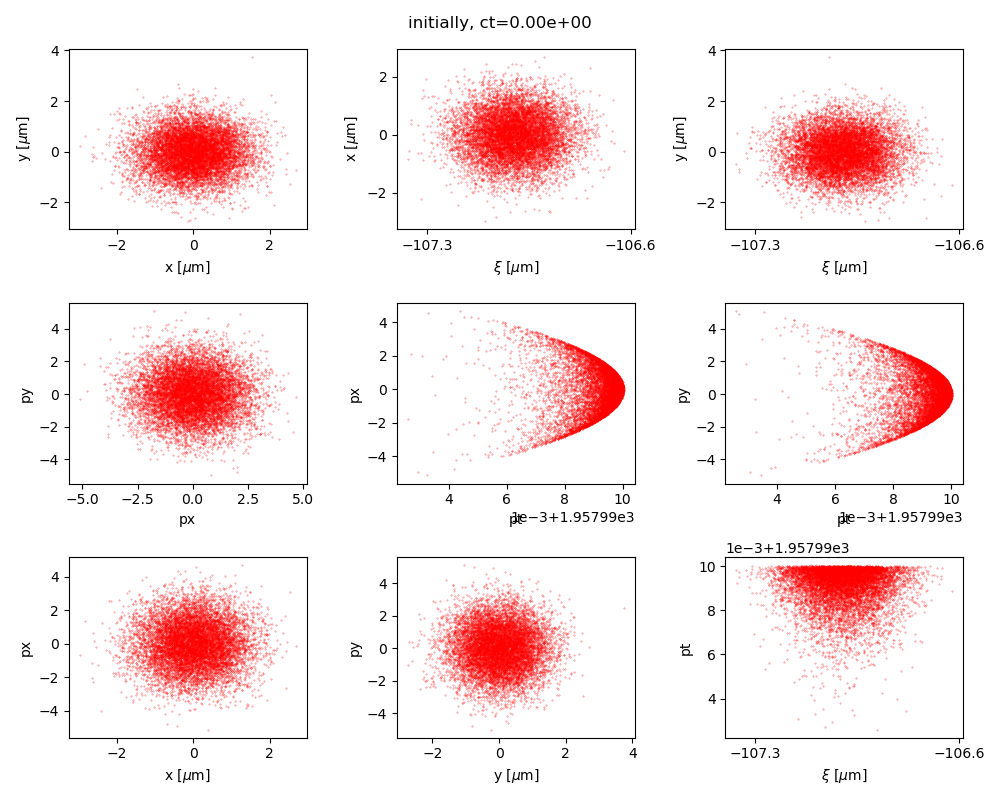

.. _examples-ml-surrogate:

9 stage laser-plasma accelerator surrogate example
==================================================

Nine stages of laser-plasma accelerators.  
The laser-plasma accelerator elements are neural network surrogate models, 
previously trained and included in ``models``.
The neural networks require normalized input data, the normalizations can be found in ``datasets``.


We use a 1 GeV electron beam with initial normalized rms emittance of 1 mm-mrad.

In this test, the initial and final values of :math:`\sigma_x`, :math:`\sigma_y`, :math:`\sigma_t`, :math:`\epsilon_x`, :math:`\epsilon_y`, and :math:`\epsilon_t` must agree with nominal values.


Run
---

This example can be **only** be run with **Python**:

* **Python** script: ``python3 run_ml_surrogate.py```

For `MPI-parallel <https://www.mpi-forum.org>`__ runs, prefix these lines with ``mpiexec -n 4 ...`` or ``srun -n 4 ...``, depending on the system.

.. tab-set::

   .. tab-item:: Python: Script

       .. literalinclude:: run_fodo.py
          :language: python3
          :caption: You can copy this file from ``examples/fodo/run_fodo.py``.


Analyze
-------

We run the following script to analyze correctness:

.. dropdown:: Script ``analyze_ml_surrogate.py``

   .. literalinclude:: analyze_ml_surrogate.py
      :language: python3
      :caption: You can copy this file from ``examples/pytorch_surrogate_model/run_ml_surrogate.py``.


Visualize
---------

You can run the following script to visualize the beam evolution over time:

.. dropdown:: Script ``visualize_ml_surrogate.py``

   .. literalinclude:: visualize_ml_surrogate.py
      :language: python3
      :caption: You can copy this file from ``examples/pytorch_surrogate_model/visualize_ml_surrogate.py``.



   9 stage LPA (via neural network surrogates) beam moments



   Initial phase space projections going into 9 stage LPA (via neural network surrogates) simulation

.. figure:: stage_8_phase_spaces.png
   :alt: Final phase space projections after 9 stage LPA (via neural network surrogates) simulation

   Final phase space projections after 9 stage LPA (via neural network surrogates) simulation
